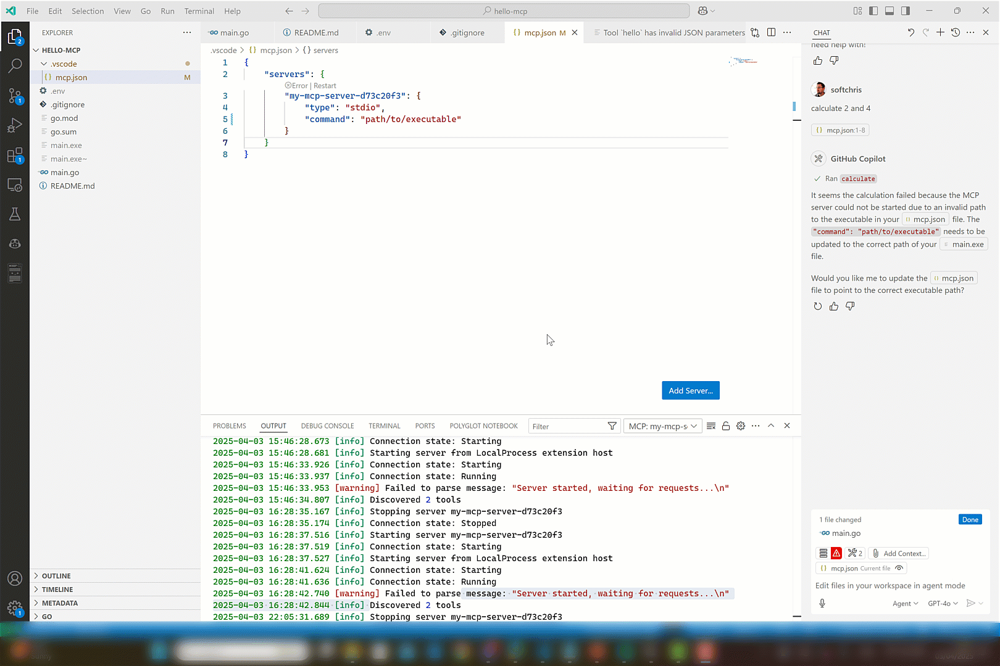

# Hello MCP Go 👋

Welcome to the **Hello MCP Go** repository! 🚀 This project demonstrates how to build an MCP (Model Context Protocol) server in Go. Whether you're a Go enthusiast or just curious about MCP, you're in the right place! 🛠️

<div>
    
</div>

## What is this? 🤔

This repository showcases:
- How to build an MCP server using Go 🐹.
- A simple and fun way to explore MCP Protocol 🎮.
- A starting point for your own custom MCP server adventures! 🌟


## Tools 🌟

- hello, takes the parameters Submitter and Content.
- calculate, takes the parameters A and B. Example use is "calculate 2 and 4".

## Quick Start 🚀

- Clone
- Install
- Build 
- Run

1. Clone the repository:
    ```bash
    git clone https://github.com/your-username/hello-mcp-go.git
    cd hello-mcp
    ```

2. Install dependencies:
    ```bash
    go mod tidy
    ```

3. Build the project:
 
    ```bash
    go build -ldflags="-s -w" -o server.exe main.go
    ```    
    or for Linux:
    ```bash
    go build -ldflags="-s -w" -o server main.go
    ```

    You will use this later when you want to consume it from Visual Studio Code. 


1. Run the server:
    ```bash
    ./server
    ```

### Consuming the Server with GitHub Copilot Agent Mode 🍴

1. Place yourself in *mcp.json*, make sure the server has been built (right now it's adjusted).

1. Adjust the "command" to point to the absolute path of your executable.

   ```json
   {
     "servers": {
        "my-mcp-server-d73c20f3": {
            "type": "stdio",
            "command": "/path/to/your/executable"
        }
     }
   }
   ```
   

1. Open Copilot and select Agent in dropdown

1. Select the play icon. 

   You should see the tool icon showing two tools.

1. Test it with a phrase like so "calculate 2 and 4". This should present a button that invokes the tool on the server.



## Have Fun! 🎉

This project is all about learning and having fun. Feel free to experiment, break things, and create something amazing! 🌈

Happy coding! 💻
